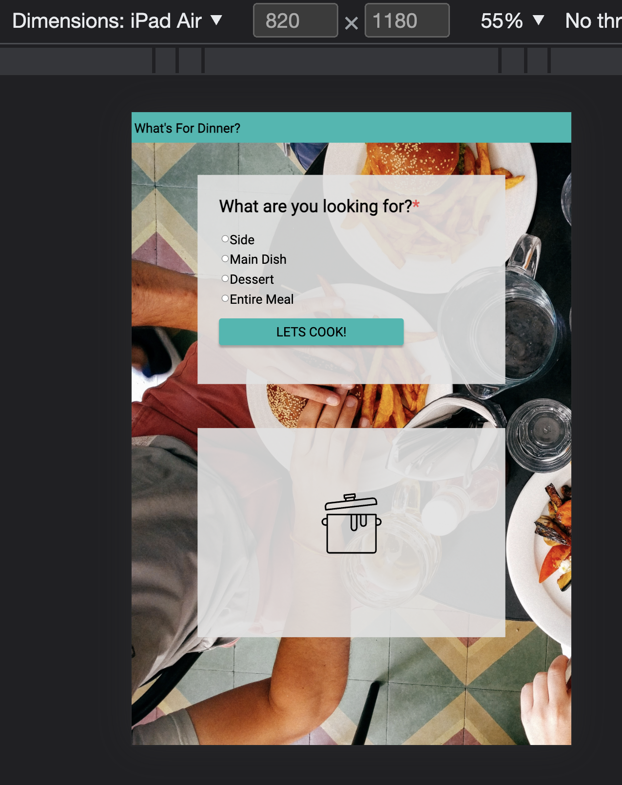
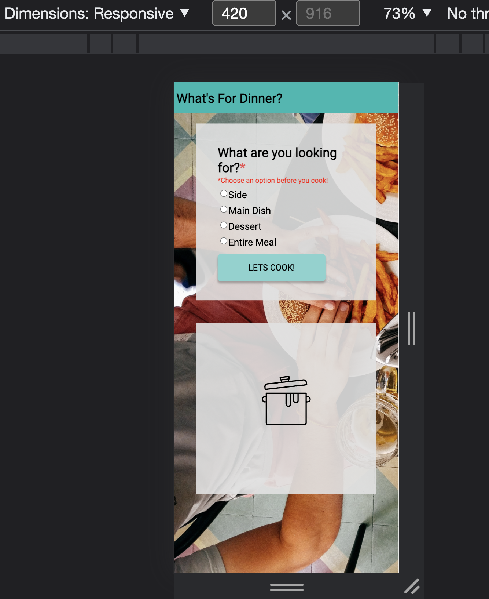
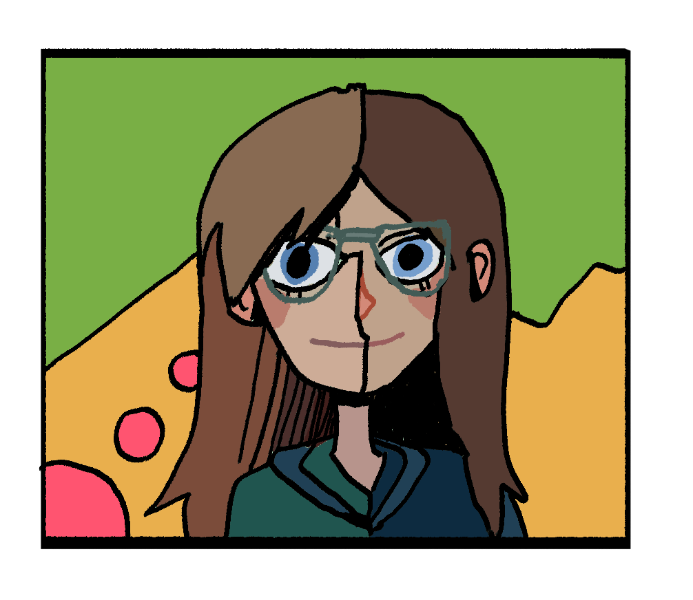

# What's for Dinner?

## Table of Contents
- [Introduction](#introduction)
- [Project Information](#project-information)
- [Set Up](#set-up)
- [Video Walkthrough](#video-walkthrough)
- [Deployed Page](#deployed-page)
- [Reflections](#reflections)
- [Technologies Implemented](#technologies-implemented)
- [Sources](#sources)
- [Contributors](#contributors)
## Introduction
What's for dinner? The ultimate question.

What's for dinner is a webpage with functional html, css elements, and javascript that allows
the user to have a food item randomly selected based on their choice.

## Project Information
#### Goals
- To utilize html and css to match a visual comp provided
- To implement functional, dynamic, and DRY code in each iteration completed
- To apply foundational knowledge of Javascript in conjunction with CSS and HTML
- To learn how to pace time for a solo project and see measure technical growth

### Project Specs
The spec for this project can be found [here](https://frontend.turing.io/projects/module-1/dinner.html).

## Setup
#### To view **What's for Dinner?:**
1. Fork this [repository](https://github.com/BlueJessen/whats-for-dinner)
2. Clone the repository into your local machine
3. Navigate into the repository, and run `open index.html` in your terminal

## Video Walkthrough
*Click Thumbnail*
(https://drive.google.com/file/d/1d3vRaydTkQ7Ll3ba7C1dtdz7txb1nUl5/view?usp=sharing)

### Illustrations For Tablet and Mobile

## Deployed Page

You can visit the published version of this project [here](https://bluejessen.github.io/whats-for-dinner/).

## Reflections

 This project taught me a lot about css for future projects.  There were a lot of hurdles, and I am glad I attempted to do the css CYOA although I didn't successfully finish the bullet points.  

 I found that the CYOA for the error handling and entire meal option lent themselves to the css, so I implemented those functionalities as well.  

 I learned that for css dynamic sizing helps with changing layouts based on device.  Due to some of my
 early project coding choices it was difficult to implement a very fluid responsive layout.  Certain elements would go out of place depending on the max width.  In the future I will keep dynamic sizing and parenting in mind when building out comps.

 If I was going to build out all the CYOA items, I would probably remake the comp from scratch with resizing in mind.  I learned that I enjoy working with javascript functionality and problem solving a lot, and in my next solo I am hoping to work on those skills more. 

## Technologies Implemented

- CSS
- HTML
- JavaScript

## Contributors

[Blue Jessen](https://github.com/BlueJessen)
