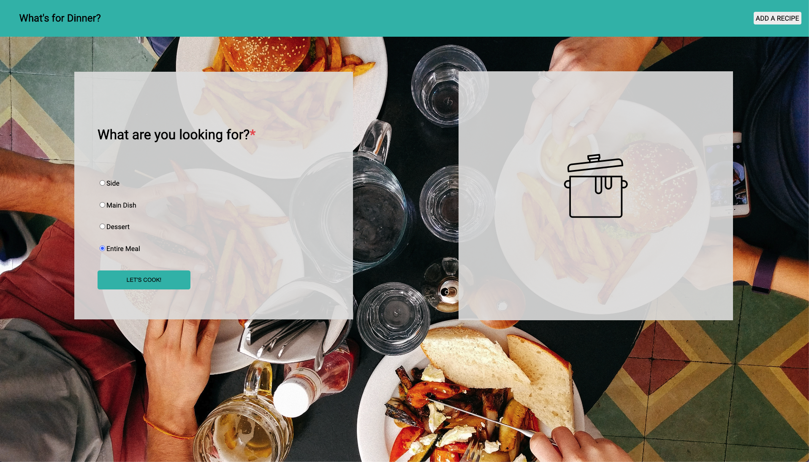
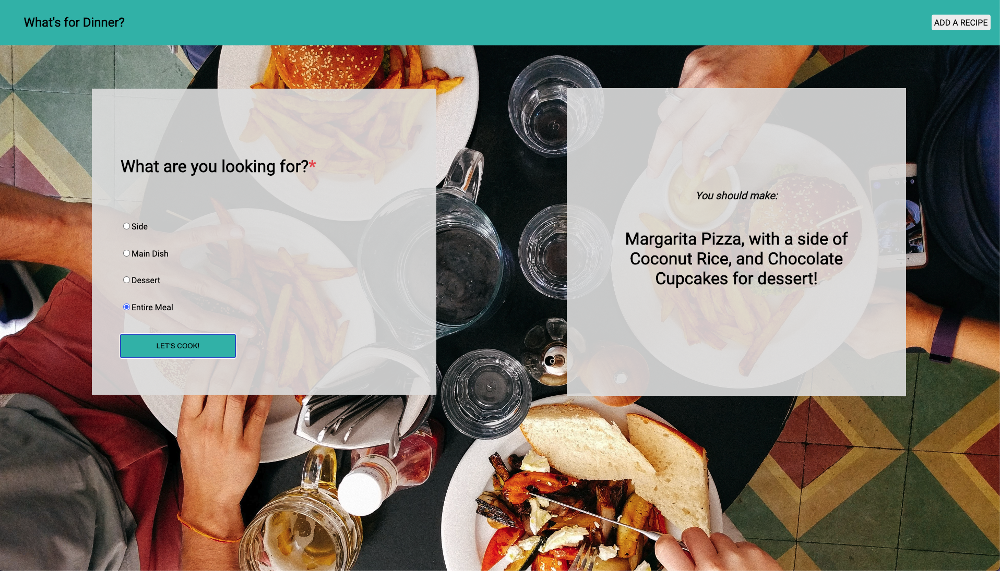

# Turin School of Software & Design exercise
## Contributors
* Joel Thomas

## Technologies used:
* JavaScript
* CSS
* HTML

## How to Use:

* Choose which meal option you desire by clicking on the radio button to the left
of the dish, and then click on the "Let's Cook!" button below.

* Look to the box on the right, and you should see a suggested meal for you to prepare!

### Future Additions

* Error handling and clear button
* User added recipes
* Login page
* Favorite specific recipes
* Delete unwanted recipes
* No repeat recipes
* View all recipes page
* Local recipe storage
* Additional CSS stylization
