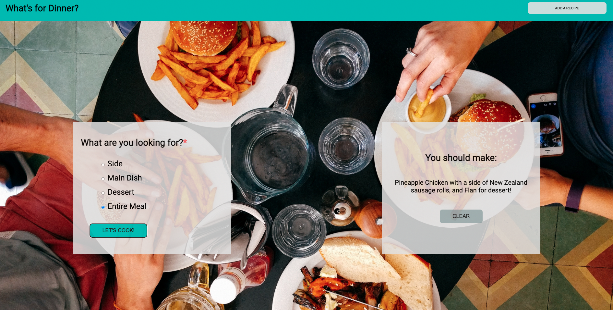

# What's for Dinner?

What's for dinner? The ultimate question. In this project, we were asked to build an app that helps users choose a side, main, and/or dessert recipe to put together meals.

## Contributors

- [Jordan Sullivan](https://github.com/jordan-sullivan)

## Technologies Used

- JavaScript
- CSS
- HTML

## Local Set-Up Instructions

- From the repo click the code button and copy the SSH link.
- Open terminal by pressing command + space bar, and search for terminal
- Inside of you terminal type "git clone" and then paste the ssh link. It should look like this: ["git@github.com:jordan-sullivan/whats-for-dinner.git"](https://github.com/jordan-sullivan/whats-for-dinner)
- In your terminal type "cd whats-for-dinner"
- Then type "open index.html"
- The browser should then deploy

## Instructions for Use

- On opening the browser, select a food option you are interested in
- Click the _LET'S COOK!_ button and your randomly generated selection will show in the box to the right.
- Press the _CLEAR_ button and make another selection as you wish.

## Code Architecture

- This project features
- The index.html file defines the structure of the content and semanitcs of the page.
- The main.js file provides the functionality for the page.
- The styles.css file houses the style choices for the application.
- The assets folder stores the foodlists.js arrays that are used to generate the meal selections, as well as the cook pot icon image, and the background image.

## Future Features

- An _Add your own recipe_ section will be added soon as displayed by button at top of page!
