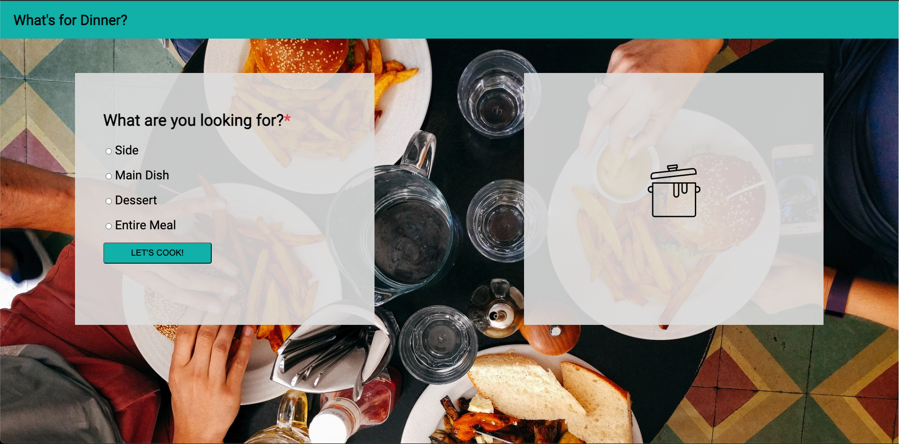
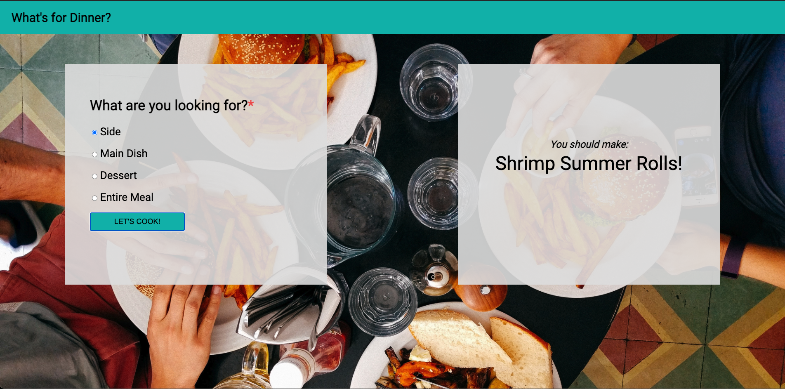
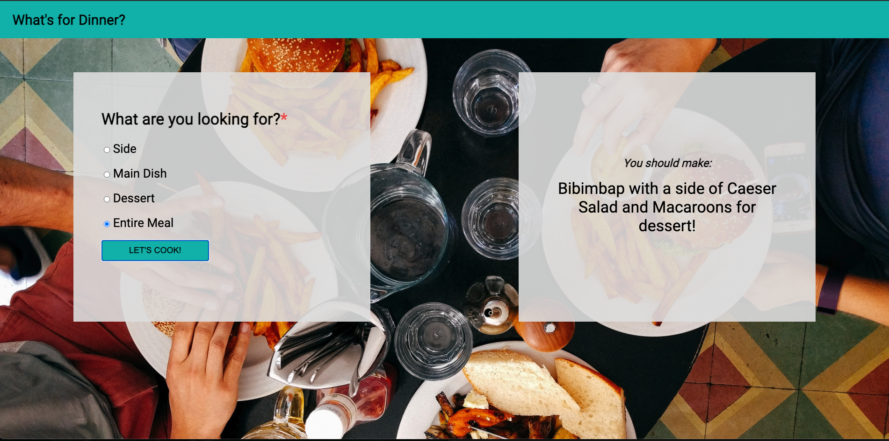

# What's for Dinner?

The spec for this project can be found [here](https://frontend.turing.io/projects/module-1/dinner.html).

# Whats for Dinner?

## Contributors:

* Ashley O'Brien
* GitHub: AshleyOh-bit
* slack: @Ashley O

## Technologies Used:

* Atom for code editing
* Google Chrome for testing
* GitHub as remote host

## Instructions:

This website is designed to provide epicureal inspiration for the user, offering randomized recipe ideas with the click of a button.

Upon page load, the user is presented with a page consisting of a teal header with text "What's for Dinner?" and two transparent, rectangular cards overlaid upon a bird's-eye image of two friends eating hamburgers and french fries. In the card on the left are four radio buttons under the text: "What are you looking for?". In order from top to bottom, these radio buttons are labeled "Side", "Main Dish", "Dessert", and "Entire Meal". Below these radio buttons is a teal button with the text "LET'S COOK!". In the card on the right is a line-drawing of a cookpot, centered on the card. Below is a screenshot of the page upon initial load:

The user can then select on of the four radio buttons, then click the "LET'S COOK!" button. Once this button is clicked, the cookpot on the card on the right disappears, and is replaced by text that either says: "You should cook:" followed by a random single dish (if Side, Main Dish, or Dessert is selected) or "You should cook:" followed by a random main dish "with" a random side dish "and" a random dessert "for dessert!". Below are two screenshots of these respective events in the order previously described.

## Future Additions:
In the future, I would hope to build out a clear button functionality. This button would appear on the recipe card on the right when the random dish(es) are displayed. When clicked, this button would refresh the card to the previous cookpot image present on page load.
